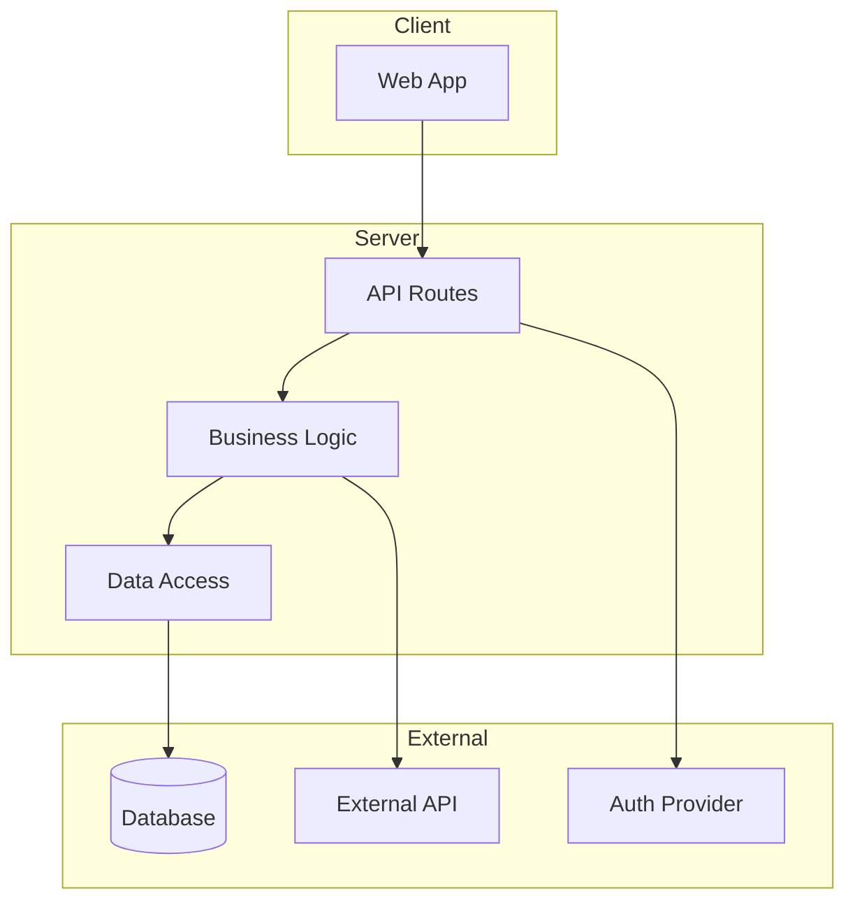
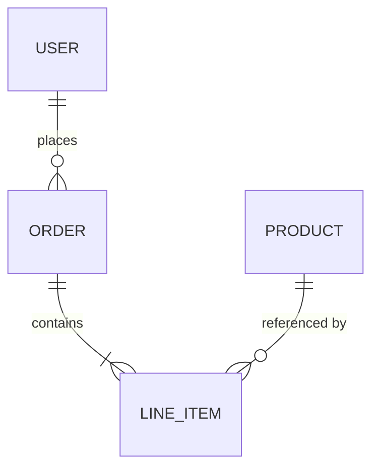

# PLAN.md Template

Use this template when generating the project's `specs/PLAN.md`. Adapt to match
the project's actual complexity — a simple app needs less than a distributed system.

---

```markdown
# {Project Name} — Technical Plan

## Tech Stack

| Layer | Choice | Rationale |
|-------|--------|-----------|
| Language | {language} | {why — performance, ecosystem, user expertise} |
| Frontend | {framework} | {why} |
| Backend | {framework/runtime} | {why} |
| Database | {database} | {why} |
| ORM/Query | {tool} | {why} |
| Auth | {provider/method} | {why} |
| Hosting | {platform} | {why} |
| Styling | {approach} | {why} |
| Testing | {framework} | {why} |

### Alternatives Considered
- {Alternative}: Not chosen because {reason}

## System Architecture



### Component Responsibilities
| Component | Responsibility | Boundary |
|-----------|---------------|----------|
| {Component} | {what it does} | {what it does NOT do} |

## Data Models

### {Entity Name}
| Field | Type | Constraints | Description |
|-------|------|-------------|-------------|
| id | uuid | PK, auto-generated | Unique identifier |
| created_at | timestamp | NOT NULL, default NOW | Creation timestamp |
| updated_at | timestamp | NOT NULL, auto-update | Last modification |
| {field} | {type} | {constraints} | {description} |

### Relationships


### Indexes
| Table | Index | Columns | Purpose |
|-------|-------|---------|---------|
| {table} | {index_name} | {columns} | {query it optimizes} |

## API Contracts

### {Domain Group — e.g., Authentication}

#### `POST /api/auth/login`
**Purpose**: Authenticate user with credentials
**Auth**: Public

**Request**:
| Field | Type | Required | Validation |
|-------|------|----------|------------|
| email | string | yes | valid email format |
| password | string | yes | min 8 chars |

**Response (200)**:
```json
{
  "user": { "id": "uuid", "email": "string", "name": "string" },
  "token": "string"
}
```

**Errors**:
| Status | Code | When |
|--------|------|------|
| 400 | INVALID_INPUT | Validation fails |
| 401 | INVALID_CREDENTIALS | Email/password wrong |

### {Next Domain Group}
...

## File Structure

```
{project-root}/
├── src/
│   ├── {organized by chosen architecture pattern}
│   └── ...
├── specs/
│   ├── SPEC.md
│   ├── PLAN.md
│   └── TASKS.md
├── tests/
│   ├── unit/
│   ├── integration/
│   └── e2e/
├── CLAUDE.md
├── llms.txt
├── {package manifest}
└── {config files}
```

## Touchpoints

Every file that will be created or modified during implementation:

| # | File Path | Action | Purpose | Tasks |
|---|-----------|--------|---------|-------|
| 1 | {path} | CREATE | {purpose} | T001 |
| 2 | {path} | CREATE | {purpose} | T003, T005 |
| ... | ... | ... | ... | ... |

## Effects

Deterministic side-effects the system produces:

| # | Trigger | Effect | Verification |
|---|---------|--------|--------------|
| 1 | User signup | Insert users row + send welcome email | Query users, check email log |
| 2 | Order placed | Insert order + line_items, charge payment | Query orders, check payment API |
| ... | ... | ... | ... |

## Mixins (Reusable Patterns)

### `requires_auth`
**Applied to**: All protected API routes
**Behavior**:
1. Extract token from Authorization header
2. Validate token (expiry, signature)
3. If invalid → 401 response
4. If valid → inject user context, continue

### `validates_input`
**Applied to**: All endpoints accepting user input
**Behavior**:
1. Parse body against endpoint schema
2. If invalid → 400 with field-specific errors
3. If valid → pass sanitized data to handler

### `{project_specific_mixin}`
...add only if a pattern repeats 3+ times...

## Architectural Constraints

| Constraint | Budget/Rule | Rationale |
|------------|-------------|-----------|
| API response time | < 200ms p95 | SPEC.md performance requirement |
| Bundle size | < 200KB gzipped | Mobile-first, 3G target |
| Test coverage | > 80% for business logic | Spec invariant verification |
| {constraint} | {budget} | {rationale} |

## Coding Conventions

- {Convention: e.g., "Named exports only, no default exports"}
- {Convention: e.g., "Server components by default, 'use client' only when needed"}
- {Convention: e.g., "Error messages must be user-facing readable"}
```

---

## Template Usage Notes

- **Every decision needs a rationale**. "We're using PostgreSQL because it's good" is not
  a rationale. "PostgreSQL because we need relational data with complex joins and JSONB
  for flexible metadata" is.
- **Touchpoints are critical**. This is the implementing agent's map. Every file it needs
  to create or modify must be listed here.
- **Effects are your integration test spec**. If you can list the effects, you can verify
  the implementation mechanically.
- **Mixins prevent drift**. When a pattern applies to multiple endpoints, defining it once
  as a mixin ensures consistent implementation.
- **Scale to complexity**. A 3-page CRUD app doesn't need the same depth as a real-time
  collaboration platform. Omit sections that add no information.
