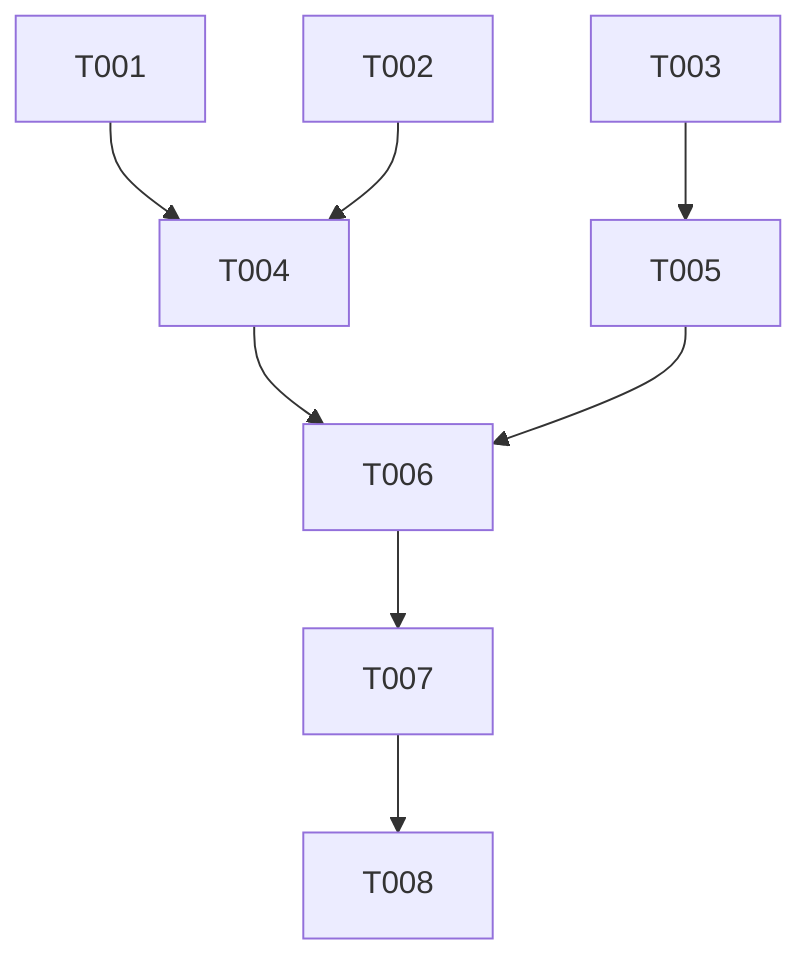

# TASKS.md Template

Use this template when generating the project's `specs/TASKS.md`. The task list must
be complete enough that an implementing agent can execute without making architectural
decisions or asking clarifying questions.

---

```markdown
# {Project Name} — Implementation Tasks

## Summary
- **Total Tasks**: {count}
- **Complexity**: {X} LOW, {Y} MEDIUM, {Z} HIGH
- **Parallel Groups**: {count} groups of parallelizable tasks
- **Layers**: Foundation → Core → Feature → Integration → Polish

## Dependency Graph



## Tasks

### Foundation Layer
> No dependencies. Can execute in parallel. Sets up project infrastructure.

---

#### T001: {Action verb + what}
- **Layer**: FOUNDATION
- **Files**: `{path/to/file1}`, `{path/to/file2}`
- **Depends On**: None
- **Complexity**: {LOW / MEDIUM / HIGH}

**Description**:
{Specific implementation instructions — what to create, key logic, patterns to apply}

**Validation**:
- [ ] {Testable verification — "Running `npm test` passes"}
- [ ] {Behavior check — "File exists and exports expected types"}

**Invariants**: {INV-001, INV-003 — reference SPEC.md invariants this task upholds}

---

#### T002: {Action verb + what}
...

---

### Core Layer
> Depends on Foundation. Implements business logic and data access.

---

#### T003: {Action verb + what}
- **Layer**: CORE
- **Files**: `{path}`
- **Depends On**: T001
- **Complexity**: MEDIUM

**Description**:
{Specific instructions}

**Validation**:
- [ ] {Verification}

**Invariants**: {INV-002}

---

### Feature Layer
> Depends on Core. Implements user-facing capabilities from SPEC.md.

---

#### T004: {Action verb + what}
...

---

### Integration Layer
> Depends on Features. Cross-feature flows and E2E scenarios.

---

#### T005: {Action verb + what}
...

---

### Polish Layer
> No dependents. Final touches — error states, loading states, edge cases.

---

#### T006: {Action verb + what}
...

---

## Execution Order

### Phase 1: Foundation (Parallel)
Execute simultaneously: T001, T002, T003

### Phase 2: Core (Sequential)
T004 — requires T001, T002

### Phase 3: Core (Parallel)
Execute simultaneously: T005, T006

### Phase 4: Features (Sequential)
T007 — requires T004, T005

### Phase 5: Features (Parallel)
Execute simultaneously: T008, T009

### Phase 6: Integration
T010 — requires T007, T008, T009

### Phase 7: Polish (Parallel)
Execute simultaneously: T011, T012

## Post-Implementation Checklist

### Spec Cross-Check
- [ ] Every SPEC.md capability implemented (list each with status)
- [ ] Every SPEC.md invariant enforced and tested:
  - [ ] INV-001: {description} — verified by {test/check}
  - [ ] INV-002: {description} — verified by {test/check}
  - [ ] ...

### Plan Cross-Check
- [ ] Every PLAN.md touchpoint created (list each with status)
- [ ] Every PLAN.md effect implemented:
  - [ ] Effect 1: {trigger} → {effect} — verified by {test}
  - [ ] ...

### Quality Gates
- [ ] All tests pass (`{test command}`)
- [ ] Lint passes (`{lint command}`)
- [ ] Type check passes (`{typecheck command}`)
- [ ] No hardcoded secrets in codebase
- [ ] Build succeeds (`{build command}`)
- [ ] No console errors/warnings in browser (if applicable)
```

---

## Template Usage Notes

- **Task descriptions must be specific**. "Set up database" is too vague.
  "Create PostgreSQL schema with users and orders tables matching PLAN.md data models,
  including indexes for email lookup and order date range queries" is specific.
- **1-3 files per task, strictly enforced**. If a task needs 4+ files, split it.
  The implementing agent works best with focused, small diffs.
- **Validation must be mechanical**. "Works correctly" is not validation.
  "Running `curl localhost:3000/api/health` returns 200 with `{ok: true}`" is validation.
- **Reference invariants by ID**. This creates traceability from SPEC.md → TASKS.md.
  During implementation, the agent can verify each invariant is enforced.
- **Execution order respects dependencies**. If the task list says T004 depends on T001,
  the implementing agent must not start T004 until T001 is verified complete.
- **Parallel groups save time**. Identify tasks that can run simultaneously.
  An implementing agent or multi-agent setup can execute these concurrently.
